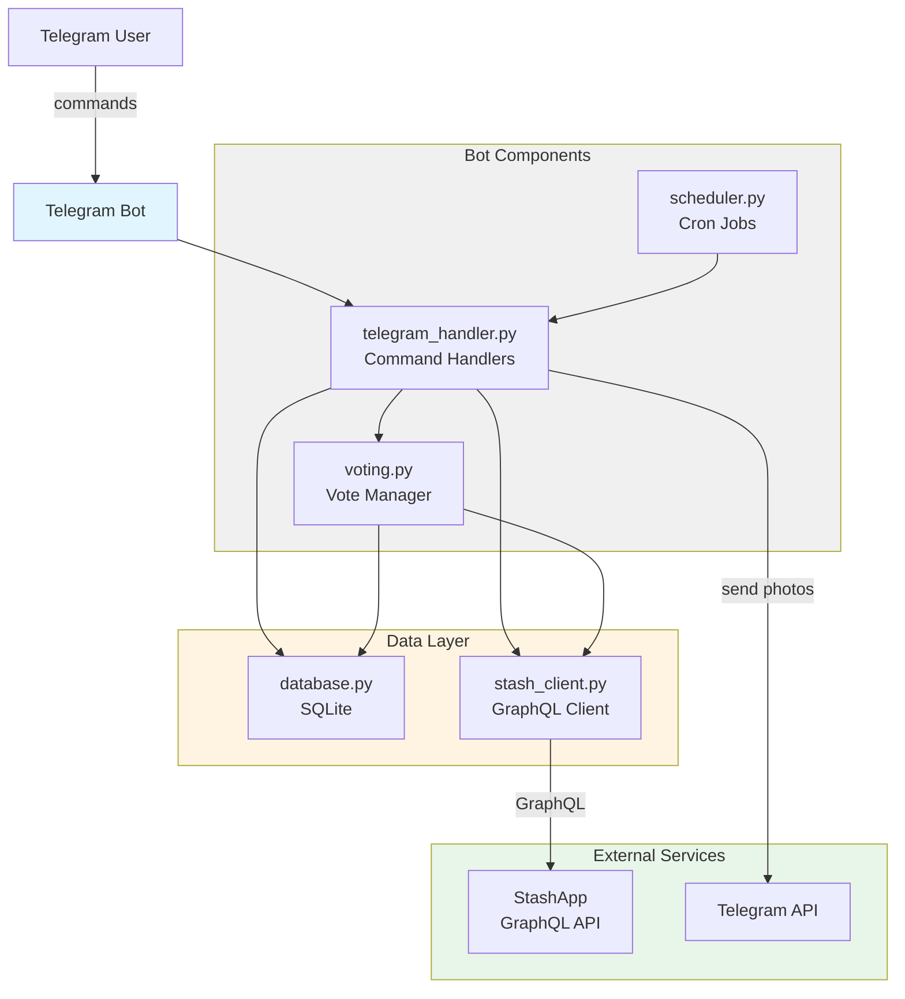
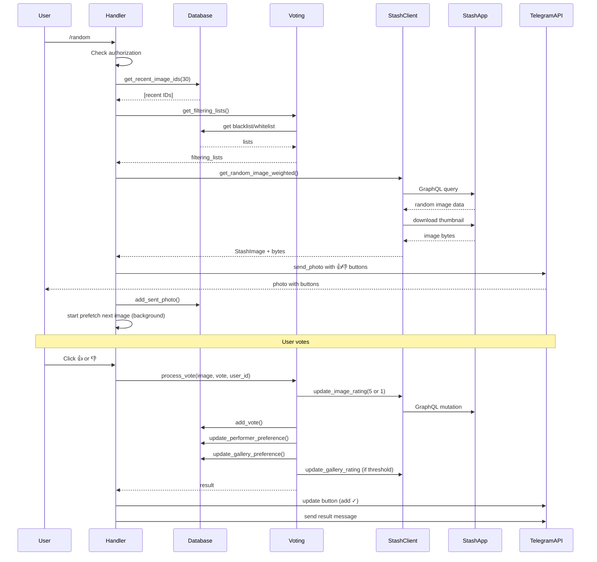

# StashApp Telegram Bot - Техническая документация для разработки

> **Главный документ для понимания проекта**  
> Последнее обновление: 2026-01-30

---

## 📋 Содержание

1. [Обзор проекта](#обзор-проекта)
2. [Архитектура](#архитектура)
3. [Система голосования](#система-голосования)
4. [Производительность и оптимизации](#производительность-и-оптимизации)
5. [Быстрый старт](#быстрый-старт)
6. [Структура проекта](#структура-проекта)

---

## Обзор проекта

### Что это

**StashApp Telegram Bot** - асинхронный Telegram бот для автоматической отправки случайных фотографий из коллекции StashApp. Проект реализует интеграцию между StashApp (система управления медиаколлекцией) и Telegram с интеллектуальной системой рекомендаций на основе голосований пользователей.

### Основные возможности

- 📸 **Отправка случайных фото** по команде `/random`
- ⏰ **Автоматическая отправка по расписанию** (настраиваемый cron)
- 👍👎 **Система голосования** с автоматическим обновлением рейтингов в StashApp
- 🎯 **Интеллектуальная фильтрация** на основе предпочтений (blacklist/whitelist)
- 🔄 **Предотвращение повторов** (настраиваемый период)
- 📊 **Статистика и предпочтения** (`/stats`, `/preferences`)
- 🔐 **Контроль доступа** по whitelist Telegram ID
- 🐳 **Простое развертывание** через Docker

### Технологический стек

**Backend:**
- Python 3.11+
- asyncio для асинхронного I/O
- aiohttp для HTTP запросов
- python-telegram-bot 20.7 для работы с Telegram API
- APScheduler 3.10.4 для планирования задач
- SQLite для хранения истории и предпочтений

**Deployment:**
- Docker и Docker Compose
- Поддержка TrueNAS Scale, Ubuntu/Debian
- GitHub Container Registry для CI/CD

---

## Архитектура

### Компоненты системы



### Модули

#### 1. `bot/main.py` - Точка входа

**Ответственность:**
- Инициализация всех компонентов
- Управление жизненным циклом приложения
- Graceful shutdown
- Настройка логирования

**Основной класс:**
```python
class Bot:
    async def initialize()  # Инициализация компонентов
    async def start()       # Запуск бота
    async def stop()        # Остановка бота
```

**Процесс запуска:**
```
Запуск → Загрузка config.yml → Инициализация БД →
→ Создание StashClient → Инициализация VotingManager →
→ Создание Telegram Application → Запуск Scheduler →
→ Polling → Ожидание завершения
```

#### 2. `bot/config.py` - Управление конфигурацией

**Ответственность:**
- Загрузка YAML конфигурации
- Валидация параметров
- Поддержка переменных окружения

**Dataclasses:**
```python
@dataclass
class TelegramConfig:
    bot_token: str
    allowed_user_ids: List[int]

@dataclass
class StashConfig:
    api_url: str
    api_key: str

@dataclass
class SchedulerConfig:
    enabled: bool
    cron: str
    timezone: str

@dataclass
class HistoryConfig:
    avoid_recent_days: int

@dataclass
class DatabaseConfig:
    path: str

@dataclass
class BotConfig:
    telegram: TelegramConfig
    stash: StashConfig
    scheduler: SchedulerConfig
    history: HistoryConfig
    database: DatabaseConfig
```

#### 3. `bot/database.py` - Работа с базой данных

**Ответственность:**
- Хранение истории отправленных фото
- Хранение голосов и предпочтений
- Предотвращение повторов
- Статистика

**Схема БД:**

```sql
-- История отправленных фото
CREATE TABLE sent_photos (
    id INTEGER PRIMARY KEY AUTOINCREMENT,
    image_id TEXT NOT NULL,
    sent_at TIMESTAMP DEFAULT CURRENT_TIMESTAMP,
    user_id INTEGER,
    title TEXT
);
CREATE INDEX idx_image_id ON sent_photos(image_id);
CREATE INDEX idx_sent_at ON sent_photos(sent_at);

-- Голоса пользователей
CREATE TABLE votes (
    id INTEGER PRIMARY KEY AUTOINCREMENT,
    image_id TEXT NOT NULL,
    user_id INTEGER NOT NULL,
    vote INTEGER NOT NULL,  -- 1 (лайк) или -1 (дизлайк)
    voted_at TIMESTAMP DEFAULT CURRENT_TIMESTAMP,
    gallery_id TEXT,
    performer_ids TEXT,
    UNIQUE(image_id, user_id)
);

-- Предпочтения по перформерам
CREATE TABLE performer_preferences (
    performer_id TEXT PRIMARY KEY,
    performer_name TEXT,
    positive_votes INTEGER DEFAULT 0,
    negative_votes INTEGER DEFAULT 0,
    total_votes INTEGER DEFAULT 0,
    score REAL DEFAULT 0.0,
    updated_at TIMESTAMP DEFAULT CURRENT_TIMESTAMP
);

-- Предпочтения по галереям
CREATE TABLE gallery_preferences (
    gallery_id TEXT PRIMARY KEY,
    gallery_title TEXT,
    positive_votes INTEGER DEFAULT 0,
    negative_votes INTEGER DEFAULT 0,
    total_votes INTEGER DEFAULT 0,
    score REAL DEFAULT 0.0,
    rating_set INTEGER DEFAULT 0,
    updated_at TIMESTAMP DEFAULT CURRENT_TIMESTAMP
);
```

**Основные методы:**
- `add_sent_photo()` - добавление записи об отправленном фото
- `get_recent_image_ids()` - получение недавних ID для исключения
- `add_vote()` - сохранение голоса
- `update_performer_preference()` - обновление предпочтений перформера
- `update_gallery_preference()` - обновление предпочтений галереи
- `get_blacklisted_performers/galleries()` - получение blacklist
- `get_whitelisted_performers/galleries()` - получение whitelist

#### 4. `bot/stash_client.py` - Клиент StashApp

**Ответственность:**
- Взаимодействие с StashApp GraphQL API
- Получение случайных изображений с фильтрацией
- Скачивание изображений (thumbnail/preview)
- Обновление рейтингов
- Обработка ошибок API

**Основные классы:**

```python
@dataclass
class StashImage:
    id: str
    title: str
    rating: int
    image_url: str
    tags: List[str]
    gallery_id: Optional[str]
    gallery_title: Optional[str]
    performers: List[Dict[str, str]]

class StashClient:
    async def get_random_image()           # Базовый запрос
    async def get_random_image_weighted()  # С учетом предпочтений
    async def download_image()             # Скачивание
    async def update_image_rating()        # Обновление рейтинга фото
    async def update_gallery_rating()      # Обновление рейтинга галереи
```

**GraphQL запрос (упрощенный):**

```graphql
query FindRandomImages($excludeIds: [ID!]) {
  findImages(
    image_filter: { id: { modifier: NOT_EQUALS, value: $excludeIds } }
    filter: { per_page: 20, sort: "random" }
  ) {
    images {
      id
      title
      rating100
      paths { thumbnail, preview, image }
      galleries { id, title }
      performers { id, name }
    }
  }
}
```

**Особенности:**
- Async context manager для управления aiohttp сессией
- Retry логика для надежности (до 5 попыток)
- Timeout: 30s total, 10s connect
- Поддержка API ключей
- Приоритет загрузки: thumbnail → preview → image

#### 5. `bot/telegram_handler.py` - Обработчики команд

**Ответственность:**
- Обработка команд пользователей
- Авторизация по whitelist
- Форматирование сообщений
- Отправка фото с кнопками голосования
- Обработка callback от кнопок
- Предзагрузка следующего изображения (оптимизация)

**Команды:**

| Команда | Описание |
|---------|----------|
| `/start` | Приветствие и инструкции |
| `/help` | Справка по командам и системе голосования |
| `/random` | Отправка случайного фото (с предзагрузкой) |
| `/stats` | Статистика отправленных фото |
| `/preferences` | Топ-5 любимых/нелюбимых перформеров и галерей |

**Поток обработки `/random`:**

```
Команда → Проверка авторизации → 
→ Есть предзагруженное фото? → ДА → Отправить мгновенно
                             → НЕТ → Получить недавние ID из БД →
→ Получить filtering lists (blacklist/whitelist) →
→ Запрос к StashApp (weighted) → Скачивание thumbnail →
→ Форматирование подписи → Отправка в Telegram с кнопками 👍👎 →
→ Сохранение в БД → Запуск фоновой предзагрузки следующего фото
```

**Предзагрузка изображений:**
- Следующее фото загружается в фоновом режиме после отправки
- Последующие запросы `/random` используют кэш (~1 сек вместо 8-13 сек)
- Автоматическая валидация актуальности кэша

#### 6. `bot/scheduler.py` - Планировщик

**Ответственность:**
- Автоматическая отправка по расписанию
- Управление cron задачами
- Поддержка временных зон

**Используемые библиотеки:**
- APScheduler - планировщик задач
- CronTrigger - cron выражения
- pytz - временные зоны

**Примеры cron:**
- `0 10 * * *` - каждый день в 10:00
- `0 9,21 * * *` - каждый день в 9:00 и 21:00
- `0 */3 * * *` - каждые 3 часа

#### 7. `bot/voting.py` - Менеджер голосования

**Ответственность:**
- Обработка голосов (👍/👎)
- Обновление рейтингов в StashApp
- Управление предпочтениями по перформерам/галереям
- Генерация списков фильтрации (blacklist/whitelist)
- Кэширование фильтров (TTL 60 сек)

**Основные методы:**

```python
class VotingManager:
    async def process_vote(image, vote, user_id)
    # Полная обработка голоса:
    # 1. Обновление рейтинга фото (5 для 👍, 1 для 👎)
    # 2. Сохранение голоса в БД
    # 3. Обновление предпочтений перформеров
    # 4. Обновление предпочтений галереи
    # 5. Автоустановка рейтинга галереи после 5+ голосов
    
    def get_preferences_summary()
    # Топ-5 любимых/нелюбимых перформеров и галерей
    
    def get_filtering_lists()
    # Списки для фильтрации (с кэшированием)
```

#### 8. `bot/performance.py` - Профилирование

**Утилиты для измерения производительности:**

```python
@timing_decorator  # Декоратор для функций
async def some_function():
    pass

with timing_context("Operation name"):  # Контекстный менеджер
    # code

timer = PerformanceTimer("Send photo")  # Детальный профайлер
timer.checkpoint("Stage 1")
timer.checkpoint("Stage 2")
timer.report()  # Вывод отчета
```

### Потоки данных

#### Отправка случайного фото с голосованием



### Асинхронная архитектура

**Event Loop:**

```python
asyncio.run(main())
  ├── Bot.initialize()
  │   ├── load_config()
  │   ├── Database.__init__()
  │   ├── StashClient.__aenter__()
  │   ├── VotingManager.__init__()
  │   └── Application.builder().build()
  │
  ├── Bot.start()
  │   ├── Scheduler.start()
  │   ├── Application.start()
  │   └── Updater.start_polling()
  │
  └── Bot.stop()
      ├── Scheduler.stop()
      ├── Application.shutdown()
      └── StashClient.__aexit__()
```

**Конкурентность:**
- Telegram polling - отдельный async task
- APScheduler - интегрирован с asyncio event loop
- HTTP запросы - aiohttp для неблокирующих операций
- Предзагрузка изображений - фоновая задача
- Database - синхронный (sqlite3), но операции быстрые

### Обработка ошибок

**Уровни:**
1. **Telegram API errors** → telegram_handler.py
2. **StashApp API errors** → stash_client.py (retry до 5 раз)
3. **Database errors** → database.py
4. **Application errors** → main.py (graceful shutdown)

**Стратегии:**
- **Retry** - для HTTP запросов к StashApp
- **Graceful degradation** - бот продолжает работу при ошибках
- **Logging** - все ошибки логируются с подробностями
- **User notification** - понятные сообщения пользователю

---

## Система голосования

### Обзор

Полная система голосования с автоматическим обновлением рейтингов в StashApp и интеллектуальной фильтрацией контента на основе предпочтений пользователей.

### Как работает

#### 1. Голосование за фото

Каждое отправленное фото имеет inline-кнопки:
- 👍 **Лайк** - понравилось
- 👎 **Дизлайк** - не понравилось

#### 2. Обработка голоса

При нажатии кнопки происходит:

```python
# Автоматическое обновление рейтинга фото в StashApp
if vote == 1:  # Лайк
    await stash_client.update_image_rating(image_id, rating=5)
else:  # Дизлайк
    await stash_client.update_image_rating(image_id, rating=1)

# Сохранение голоса с контекстом
database.add_vote(
    image_id=image_id,
    user_id=user_id,
    vote=vote,
    gallery_id=image.gallery_id,
    performer_ids=image.performers
)

# Обновление предпочтений для каждого перформера
for performer in image.performers:
    database.update_performer_preference(
        performer_id=performer['id'],
        performer_name=performer['name'],
        vote=vote
    )

# Обновление предпочтений галереи
if image.gallery_id:
    database.update_gallery_preference(
        gallery_id=image.gallery_id,
        gallery_title=image.gallery_title,
        vote=vote
    )
```

#### 3. Автоматический рейтинг галереи

После накопления 5+ голосов за фото из галереи:
- Рассчитывается процент положительных голосов
- Преобразуется в рейтинг 1-5 звезд
- Рейтинг устанавливается в StashApp **однократно**

**Формула:**
- 0-20% положительных → ⭐ (1 звезда)
- 20-40% → ⭐⭐ (2 звезды)
- 40-60% → ⭐⭐⭐ (3 звезды)
- 60-80% → ⭐⭐⭐⭐ (4 звезды)
- 80-100% → ⭐⭐⭐⭐⭐ (5 звезд)

### Система предпочтений

#### Score формула

```python
score = (positive_votes - negative_votes) / total_votes
```

**Диапазон:** -1.0 (только дизлайки) до +1.0 (только лайки)

#### Blacklist (score < 0)

Перформеры и галереи с отрицательным score:
- **Полностью исключаются** из выдачи
- Их контент никогда не отправляется

#### Whitelist (score > 0)

Перформеры и галереи с положительным score:
- **Приоритизируются** в выдаче
- Если есть whitelist, контент не из него пропускается с вероятностью 50%

### Команда `/preferences`

Показывает статистику предпочтений:

```
📊 Ваши предпочтения

👥 Топ-5 любимых перформеров:
1. Performer A (score: 0.85, 17 лайков, 3 дизлайка)
2. Performer B (score: 0.75, 12 лайков, 4 дизлайка)
...

👎 Топ-5 нелюбимых перформеров:
1. Performer X (score: -0.60, 2 лайка, 8 дизлайков)
...

📁 Топ-5 любимых галерей:
...

📁 Топ-5 нелюбимых галерей:
...

📈 Общая статистика:
• Всего голосов: 45
• Лайков: 32 (71%)
• Дизлайков: 13 (29%)
```

### Интеллектуальная фильтрация

При запросе `/random` бот:

1. **Получает списки фильтрации** (с кэшированием 60 сек):
   - Blacklisted performers (score < 0)
   - Blacklisted galleries (score < 0)
   - Whitelisted performers (score > 0)
   - Whitelisted galleries (score > 0)

2. **Запрашивает 20 случайных изображений** из StashApp

3. **Применяет фильтры:**
   - Исключает фото с blacklisted performers/galleries
   - Если есть whitelist - пропускает 50% фото не из whitelist
   - Если нет подходящих - retry (до 5 попыток)

4. **Отправляет фото** с учетом предпочтений

### Кэширование

Списки фильтрации кэшируются на 60 секунд:
- Уменьшает нагрузку на БД
- Инвалидируется после каждого голосования
- Логируется использование кэша

```python
# Логи
⏱️  Using cached filtering lists (age: 45.2s)
# или
⏱️  Refreshing filtering lists cache
```

### Глобальные vs Индивидуальные предпочтения

**Текущая реализация:** Глобальные предпочтения
- Все пользователи бота делят общую статистику
- Голоса от всех пользователей влияют на фильтрацию

**Возможное улучшение:** Индивидуальные предпочтения
- Каждый пользователь имеет свои предпочтения
- Требует добавления `user_id` в performer_preferences и gallery_preferences

---

## Производительность и оптимизации

### Система профилирования

#### Модуль `bot/performance.py`

Предоставляет утилиты для измерения производительности:

```python
# 1. Декоратор для функций
@timing_decorator
async def expensive_operation():
    # Автоматически логирует время выполнения
    pass

# 2. Контекстный менеджер
with timing_context("Download image"):
    image_data = await download()

# 3. Детальный профайлер
timer = PerformanceTimer("Send random photo")
timer.checkpoint("Get recent IDs")
# ... операции ...
timer.checkpoint("Download image")
# ... операции ...
timer.report()  # Красивый отчет
```

#### Пример Performance Report

```
============================================================
⏱️  Performance Report: Send random photo
------------------------------------------------------------
  Get recent IDs from DB...................... 0.003s (  0.5%)
  Get filtering lists from DB................. 0.009s (  1.5%)
  Get random image (weighted)................. 0.455s ( 75.4%)
  Download image.............................. 0.120s ( 19.9%)
  Send to Telegram............................ 0.015s (  2.5%)
  Save to database............................ 0.002s (  0.3%)
------------------------------------------------------------
  TOTAL....................................... 0.604s (100.0%)
============================================================
```

### Реализованные оптимизации

#### 1. Кэширование фильтров

```python
# bot/voting.py
class VotingManager:
    def __init__(self, cache_ttl=60):
        self._filtering_cache = None
        self._cache_timestamp = None
        self._cache_ttl = cache_ttl
```

**Эффект:** Экономия ~0.01-0.02 сек на каждый запрос после первого

#### 2. Оптимизация GraphQL запросов

```python
# Было: 50 изображений + теги
per_page: 50
tags { name }

# Стало: 20 изображений без тегов
per_page: 20
# tags убраны
```

**Эффект:** Уменьшение объема данных на ~60%, ускорение запроса на 30-40%

#### 3. Использование thumbnail вместо preview

```python
# bot/stash_client.py
class StashImage:
    def __init__(self, data):
        paths = data.get('paths', {})
        # Приоритет: thumbnail → preview → image
        self.image_url = (
            paths.get('thumbnail') or 
            paths.get('preview') or 
            paths.get('image', '')
        )
```

**Эффект:** 
- Размер файла: ~15-30 KB вместо ~50-100 KB
- Скорость загрузки: 3-5x быстрее
- Скорость отправки в Telegram: 3-5x быстрее

#### 4. Предзагрузка следующего изображения

```python
# bot/telegram_handler.py
async def _send_random_photo(self, ...):
    # Используем предзагруженное, если есть
    if self._prefetched_image:
        if prefetched_image.id not in recent_ids:
            logger.info("⚡ Используется предзагруженное изображение")
            image = prefetched_image
            # ... мгновенная отправка ...
    
    # После отправки - запускаем предзагрузку следующего
    asyncio.create_task(self._prefetch_next_image())
```

**Эффект:**
- Первый `/random`: 2-4 сек (с thumbnail)
- Последующие `/random`: ~1 сек (из кэша)
- Улучшение: **8-13x быстрее**

**Особенности:**
- Автоматическая валидация актуальности кэша
- Синхронизация через asyncio.Lock
- Работает только для команды `/random` (не для планировщика)

#### 5. Timeout для HTTP запросов

```python
# bot/stash_client.py
timeout = aiohttp.ClientTimeout(
    total=30,    # Максимум 30 секунд на весь запрос
    connect=10   # Максимум 10 секунд на подключение
)
self.session = aiohttp.ClientSession(timeout=timeout)
```

**Эффект:** Предотвращение зависаний при проблемах с сетью

### Метрики производительности

#### Целевые значения

**Хорошая производительность:**
- Общее время: **< 3 сек**
- GraphQL запрос: **< 0.5 сек**
- Скачивание thumbnail: **< 0.2 сек**
- Отправка в Telegram: **< 0.5 сек**

**Приемлемая производительность:**
- Общее время: **3-5 сек**
- GraphQL запрос: **0.5-1.0 сек**
- Скачивание thumbnail: **0.2-0.5 сек**
- Отправка в Telegram: **0.5-1.0 сек**

**Требует оптимизации:**
- Общее время: **> 5 сек** ❌

#### Анализ узких мест

**Если "Get random image (weighted)" > 70%:**
- Проблема: Медленный StashApp или множественные retry
- Решения: Проверить сеть, уменьшить фильтры, индексация в StashApp

**Если "Download image" > 40%:**
- Проблема: Большие preview
- Решения: Уменьшить размер preview в StashApp, использовать thumbnail

**Если "Send to Telegram" > 30%:**
- Проблема: Медленный интернет
- Решения: Проверить соединение, уменьшить размер изображения

### Сравнение до/после

| Метрика | До оптимизаций | После | Улучшение |
|---------|----------------|-------|-----------|
| GraphQL запрос | 0.5-0.8s | 0.3-0.5s | **30-40%** ⚡ |
| Запросы к БД (2+ раз) | ~0.01s | ~0.001s | **90%** ⚡ |
| Размер изображения | 50-100 KB | 15-30 KB | **3-5x** ⚡ |
| Первый `/random` | 8-13s | 2-4s | **3-4x** ⚡ |
| Последующие `/random` | 8-13s | ~1s | **8-13x** ⚡⚡ |

---

## Быстрый старт

### Предварительные требования

- Python 3.11+ (для локального запуска)
- Docker и Docker Compose (рекомендуется)
- Работающий экземпляр StashApp
- Telegram Bot Token от [@BotFather](https://t.me/BotFather)

### 1. Создание Telegram бота

```bash
# 1. Откройте @BotFather в Telegram
# 2. Отправьте: /newbot
# 3. Следуйте инструкциям
# 4. Сохраните токен: 1234567890:ABCdef...
# 5. Узнайте свой Telegram ID через @userinfobot
```

### 2. Настройка конфигурации

```bash
# Скопируйте пример конфигурации
cp config.example.yml config.yml

# Отредактируйте config.yml
```

**Минимальная конфигурация:**

```yaml
telegram:
  bot_token: "YOUR_BOT_TOKEN_HERE"
  allowed_user_ids:
    - 123456789  # Ваш Telegram ID

stash:
  api_url: "http://localhost:9999/graphql"
  api_key: ""  # Опционально

scheduler:
  enabled: true
  cron: "0 10 * * *"  # Каждый день в 10:00
  timezone: "Europe/Moscow"

history:
  avoid_recent_days: 30

database:
  path: "/data/sent_photos.db"
```

### 3. Запуск через Docker (рекомендуется)

```bash
# Создайте директории для данных
mkdir -p data logs

# Запустите контейнер
docker-compose up -d

# Просмотр логов
docker-compose logs -f
```

### 4. Запуск локально (для разработки)

```bash
# Создайте виртуальное окружение
python -m venv venv
source venv/bin/activate  # Linux/Mac
# или venv\Scripts\activate  # Windows

# Установите зависимости
pip install -r requirements.txt

# Запустите бота
python -m bot.main
```

### 5. Проверка работы

Откройте вашего бота в Telegram и отправьте:

```
/start      - Приветствие
/random     - Случайное фото
/stats      - Статистика
```

### Команды управления (Makefile)

```bash
make build    # Собрать Docker образ
make up       # Запустить бот
make down     # Остановить бот
make logs     # Просмотр логов
make restart  # Перезапустить
make backup   # Резервная копия БД
make stats    # Статистика из БД
make shell    # Войти в контейнер
```

### Подключение к StashApp в Docker

Если StashApp уже запущен в Docker, добавьте бота в ту же сеть:

```yaml
# docker-compose.yml
services:
  stash-telegram-bot:
    # ...
    networks:
      - stash-network

networks:
  stash-network:
    external: true
    name: stash_default  # Имя сети StashApp
```

---

## Структура проекта

```
stash-telegram-bot/
├── bot/                          # Исходный код
│   ├── __init__.py              # Инициализация пакета
│   ├── main.py                  # Точка входа (228 строк)
│   ├── config.py                # Управление конфигурацией (107 строк)
│   ├── database.py              # Работа с SQLite БД (164 строки)
│   ├── stash_client.py          # GraphQL клиент StashApp (465 строк)
│   ├── telegram_handler.py      # Обработчики Telegram команд (304 строки)
│   ├── scheduler.py             # Планировщик отправки (131 строка)
│   ├── voting.py                # Менеджер голосования (новое)
│   └── performance.py           # Утилиты профилирования (новое)
│
├── data/                        # Данные (не в git)
│   └── sent_photos.db          # SQLite база данных
│
├── logs/                        # Логи (не в git)
│   └── bot.log                 # Файл логов
│
├── docs/                        # Документация
│   ├── DEPLOYMENT.md           # Инструкции по развертыванию
│   └── GITHUB_REGISTRY.md      # Работа с GitHub Container Registry
│
├── Dockerfile                   # Docker образ
├── docker-compose.yml          # Оркестрация контейнеров
├── docker-compose.ghcr.yml    # Вариант с GHCR
├── requirements.txt            # Python зависимости
├── config.example.yml          # Пример конфигурации
├── config.yml                  # Конфигурация (не в git)
├── Makefile                    # Команды управления
├── .gitignore                  # Git ignore правила
├── .dockerignore               # Docker ignore правила
├── README.md                   # Основная документация
├── CHANGELOG.md                # История изменений
└── CURSOR.md                   # Этот файл ⭐
```

### Описание модулей

| Модуль | Строк | Назначение |
|--------|-------|------------|
| `main.py` | 228 | Инициализация, запуск, graceful shutdown |
| `config.py` | 107 | Загрузка и валидация конфигурации |
| `database.py` | 164 | SQLite: история, голоса, предпочтения |
| `stash_client.py` | 465 | GraphQL API, загрузка изображений |
| `telegram_handler.py` | 304 | Команды, отправка фото, callback |
| `scheduler.py` | 131 | Автоматическая отправка по cron |
| `voting.py` | 200+ | Голосование, предпочтения, фильтрация |
| `performance.py` | 168 | Профилирование и метрики |

**Всего:** ~1700 строк кода

### Основные классы и функции

```python
# bot/main.py
class Bot:
    async def initialize()
    async def start()
    async def stop()

# bot/config.py
@dataclass class BotConfig
def load_config(path) -> BotConfig

# bot/database.py
class Database:
    def add_sent_photo()
    def get_recent_image_ids()
    def add_vote()
    def update_performer_preference()
    # ... + 10+ методов

# bot/stash_client.py
@dataclass class StashImage
class StashClient:
    async def get_random_image()
    async def get_random_image_weighted()
    async def download_image()
    async def update_image_rating()
    # ... + 5+ методов

# bot/telegram_handler.py
class TelegramHandler:
    async def start_command()
    async def random_command()
    async def stats_command()
    async def preferences_command()
    async def handle_vote_callback()
    async def _send_random_photo()
    async def _prefetch_next_image()
    # ... + 5+ методов

# bot/scheduler.py
class PhotoScheduler:
    def start()
    def stop()

# bot/voting.py
class VotingManager:
    async def process_vote()
    def get_preferences_summary()
    def get_filtering_lists()

# bot/performance.py
@timing_decorator
with timing_context()
class PerformanceTimer
```

### Зависимости (requirements.txt)

```txt
python-telegram-bot==20.7  # Telegram API
aiohttp==3.9.1            # Async HTTP client
APScheduler==3.10.4       # Планировщик задач
PyYAML==6.0.1             # YAML конфигурация
python-dotenv==1.0.0      # .env поддержка
```

### Конфигурационные файлы

| Файл | Назначение |
|------|------------|
| `config.yml` | Основная конфигурация (токены, расписание, настройки) |
| `.env` | Переменные окружения (опционально) |
| `docker-compose.yml` | Конфигурация Docker контейнеров |
| `Dockerfile` | Описание Docker образа |
| `.gitignore` | Игнорируемые файлы (config.yml, data/, logs/) |

---

## Дополнительные ресурсы

### Документация

- **README.md** - Getting started, основная документация
- **CHANGELOG.md** - История версий и изменений
- **docs/DEPLOYMENT.md** - Детальные инструкции по развертыванию
- **docs/GITHUB_REGISTRY.md** - CI/CD через GitHub Container Registry

### Полезные ссылки

- [python-telegram-bot Documentation](https://docs.python-telegram-bot.org/)
- [StashApp Documentation](https://github.com/stashapp/stash)
- [APScheduler Documentation](https://apscheduler.readthedocs.io/)
- [Docker Documentation](https://docs.docker.com/)

### Безопасность

- ✅ Whitelist авторизация по Telegram ID
- ✅ Токены в переменных окружения
- ✅ Непривилегированный пользователь в Docker
- ✅ Read-only монтирование конфигурации
- ✅ Изоляция в Docker сети
- ✅ Rate limiting для команд (10 сек между `/random`)

### Качество кода

- ✅ Type hints для всех функций
- ✅ Docstrings для всех публичных методов
- ✅ Следование PEP 8
- ✅ Async/await best practices
- ✅ Proper error handling
- ✅ Comprehensive logging
- ✅ Performance monitoring

---

## Версия документа

**Версия:** 1.0.0  
**Дата:** 2026-01-30  
**Автор:** Консолидация из ARCHITECTURE.md, VOTING_SYSTEM.md, PERFORMANCE_ANALYSIS.md

**Статус:** ✅ Production Ready

---

*Этот документ является главным источником технической информации о проекте для разработчиков и контрибьюторов.*
